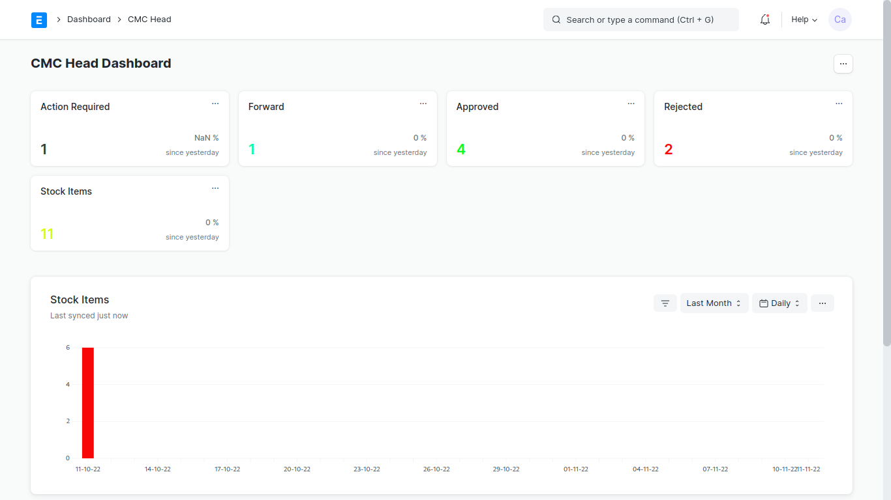
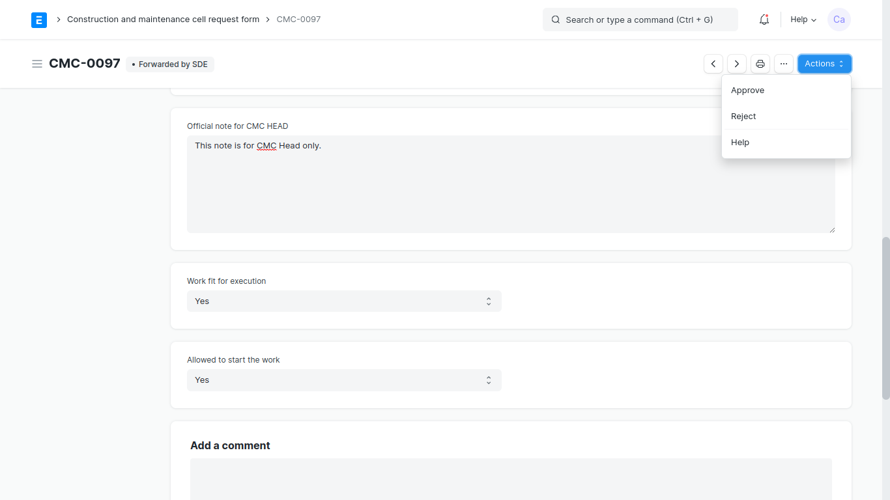

[Previous](Sde.md) | [Index](README.md) 

### How CMC Head will take actions on the request

1. Go on [erp.gndec.in](https://erp.gndec.ac.in/)

2. Login with credentails then click on `GNDEC Login`.

  

4. Go on `Switch To Desk` under profile.

5. Go on`CMC Correspondance`.

3. You will see `CMC Dashboard` where you find several status like `Action Required`, `Forward`, `Approved`, `Rejected` and `Stock Items`.

  

4. Now when you will click on any status, you will see requests respecctively.

5. Open `Action Required` go to some request which are `Forwarded` from SDE.

6.  Then open the request and put the `Sanctioned Cost`. Sanctioned cost is that cost which is allotted by the CMC Head fo the work.

7. Select `Yes` or `No` in `Work fit for execution`.

8. Give permission to `Allowed start to the work`.

9. Click on `Save` button.

10. Now you will see `Action` button and can take corresponding action like `Approve` and `Reject`.

  

11. Go on the `Logo` left hand side to go `CMC Correspondance` again.

 

[Previous](Sde.md) | [Index](README.md) 

