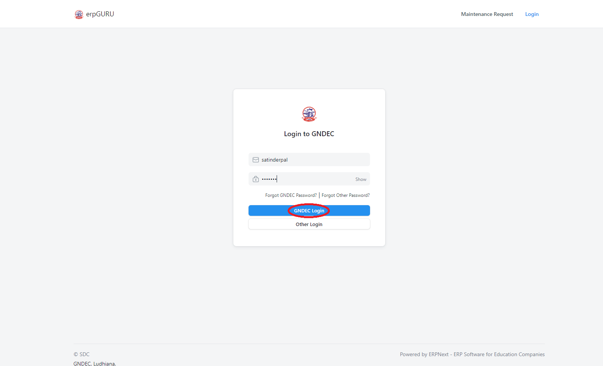

[Previous](README.md) | [Index](README.md) | [Next](Hod.md)

1. Go on [erp.gndec.ac.in](https://erp.gndec.ac.in/) 

  

2. Login with your credentials.
4. Click on `GNDEC Login`.
   

  

5. Go on Maintanance Request Form. It will show you CMC Request form.

  

## Fill the CMC Request form 

1. In `Subject Field`. 

   Fill the subject regarding the problem you facing like `Broken Door` 
   
2. Select `Nature of work`.
   
   Example : Carpentary 
   
3. `Detail of Required work`. 

   Here give the sufficent information about the request.
   
4. `Place of work`.
 
   Describe where you facing the problem.
   
5. `Justification of request`.

    Give justification about the complaint.
   
6. `Attach image`.

   You can attach the image if you think it is required.
   
7. `Caption/Description of Image`.
   
8. Click on `Save` Button.

  

9. Now you will see `Your request has been submitted successfully`

  

10. After submitting sucessfully you will get redirect to your profile page.

  

11. Go to `My Requests` to check the status of your request.

  

12. Now you can see the status of your request and you can also click on `Create New Complaint` to post another request.

  

[Previous](README.md) | [Index](README.md) | [Next](Hod.md)

