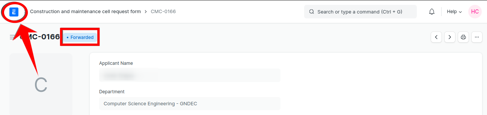

[Previous](Hod.md) | [Index](README.md) | [Next](Sde.md)

### How HOD take actions on the request

1. Go on [erp.gndec.in](https://erp.gndec.ac.in/)

2. Click on login

  

3. Enter Credentails then click on `GNDEC Login`.

  

4. After login go on `profile logo` and click on `switch to desk`.

  

5. Click on the `CMC correspondence` option.

  

6. Now you will see `HoD Dashboard` where you will find different status of requests like `Action Required`, `Forward`, `Reject` and `Keep Pending`.

  

7. Under `Action Required` you will find only those requests which is pending for the action taken by HoD.

  

8. Now when we open the request which is inside `Action Required`. You can add comment and click on `Action` button to `Forward` the request based on details.

  

9. Now after doing "Forward" you will see that the status is now changed of that request. Now click on the above right side site logo to go back to desk.

  

10. Click on the `CMC correspondence` option.

  

11. Now you can see that the status of the request is changed and you will able to see in "Forward".

  

12. Go to `Action required` again to reject one request.

  

13. Now when we open the request which is inside `Action Required`. You can add comment and click on `Action` button to `Reject` the request based on details.

  

14. Now after doing "Reject" you will see that the status is now changed of that request. Now click on the above right side site logo to go back to desk.

  

15. Now you will see that the "Keep pending" status got one request. Now click on "Keep pending" status which contain rejected requests.

  

16. After clicking on the request click on `Action` button again. Now you will see that you can finallize your dicision `Forward anyway` or `Confirm rejection`.

  

[Previous](Hod.md) | [Index](README.md) | [Next](Sde.md)

