[Previous](Hod.md) | [Index](README.md) | [Next](Cmc_Official.md)

1. Go on [erp.gndec.in](https://erp.gndec.ac.in/)

2. Click on login

  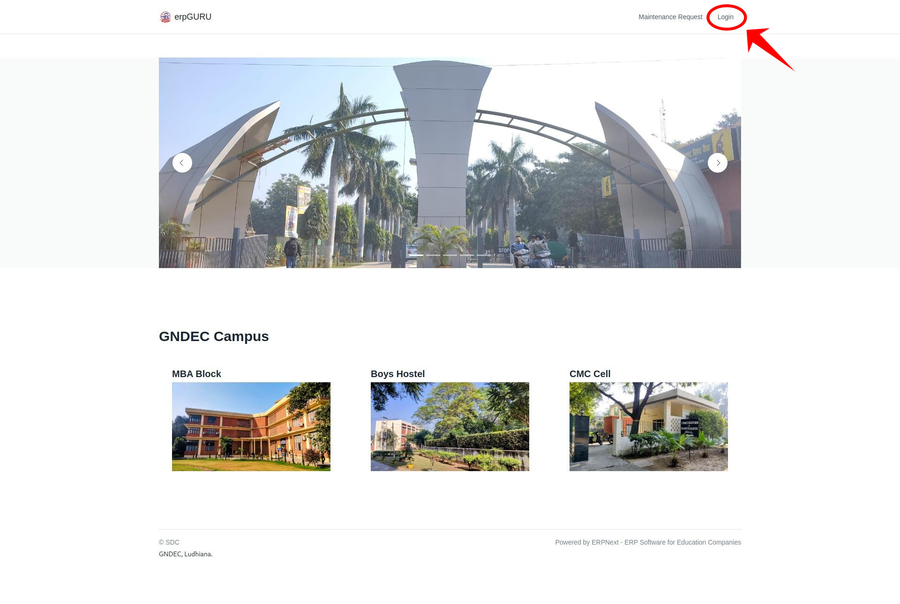

3. Enter Credentails then click on `GNDEC Login`.

  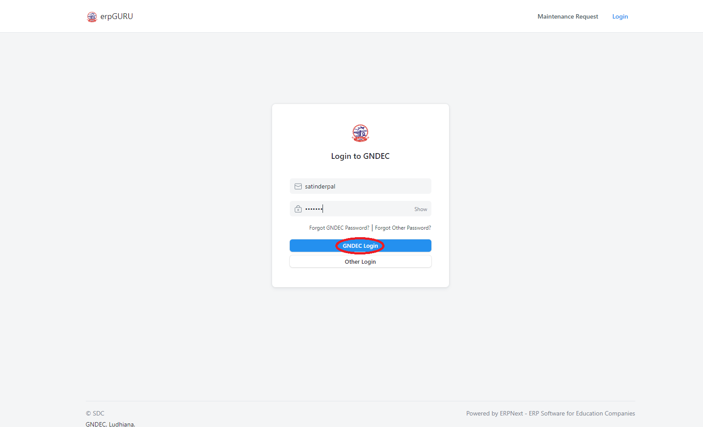

4. After login go on `profile logo` and click on `switch to desk`.

  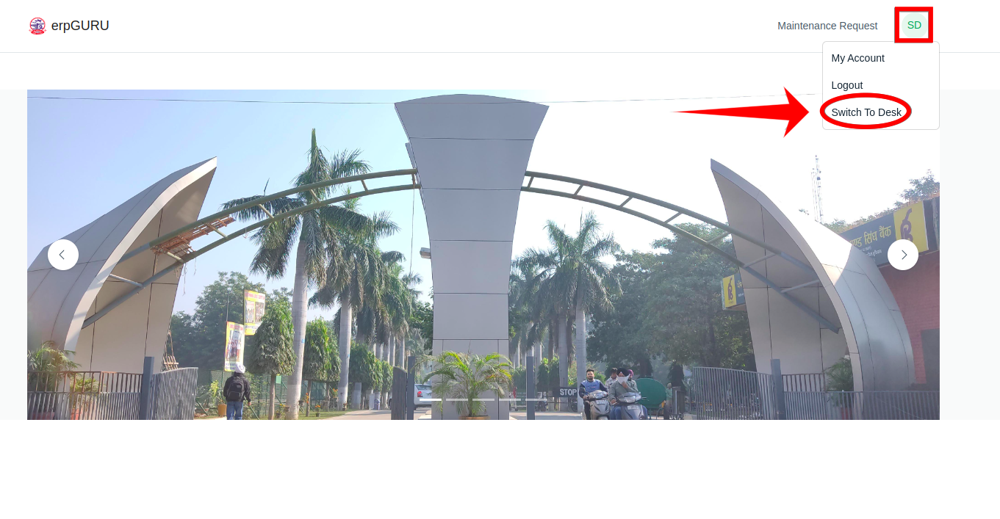

5. Click on the `CMC correspondence` option.

  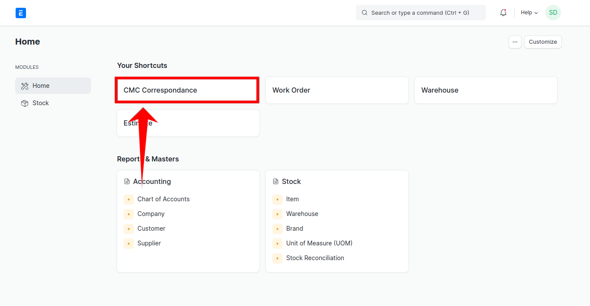

6. Now you will see `SDE Dashboard`, where you will see different status of requests like `Action Required`, `Forward`, `Approved by CMC`, `Rejected by CMC`, `On Hold` and `Stock Items`.

  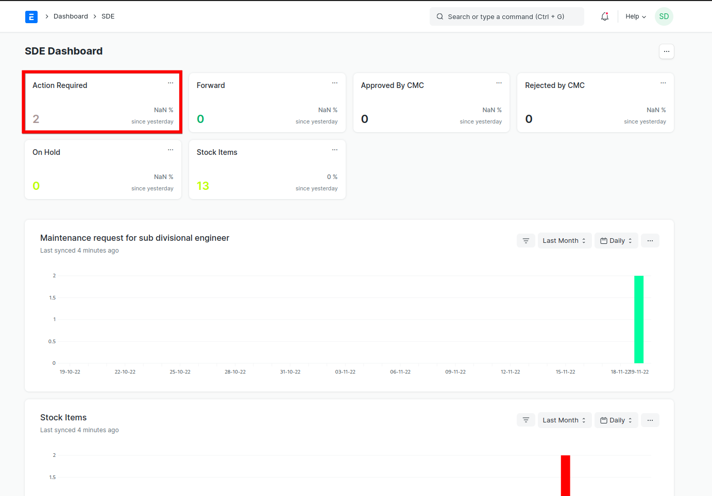

7. Now when you will click on any status you will see requests respectively. Open `Action Required` go to some request which are `Forwarded` from HoD.

  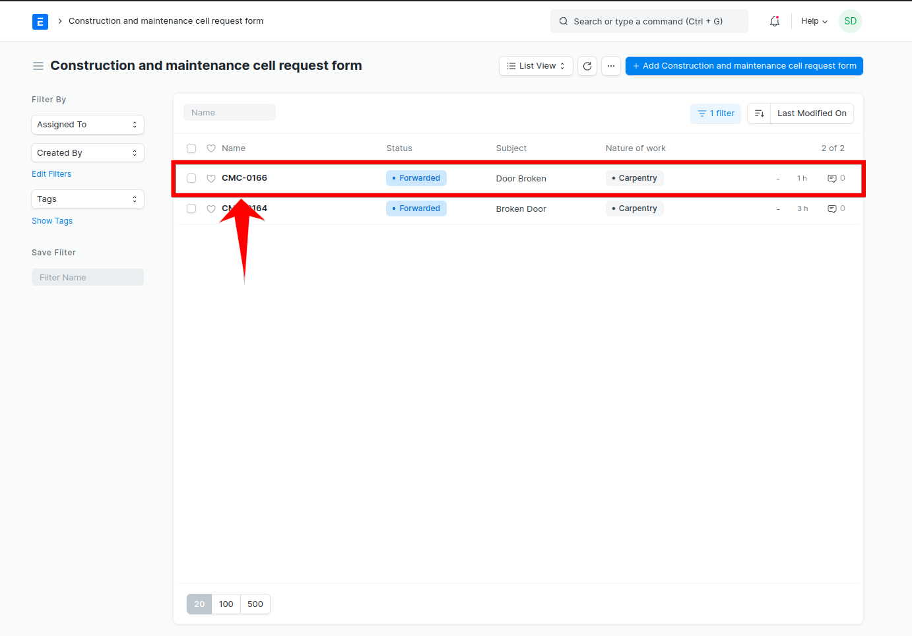

8. Then based on the request information. Go to `Estimate Table` and fill the required information like :

   - `Stock`
   - Click on `Add row` and fill the information respectively.
   - `Quantity`
   - `Labour Cost`
   - `Time estimate`
   - `Units`

  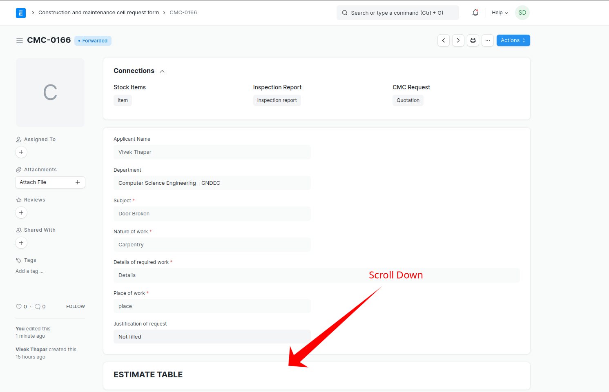

   
9. Add labour cost.
   

  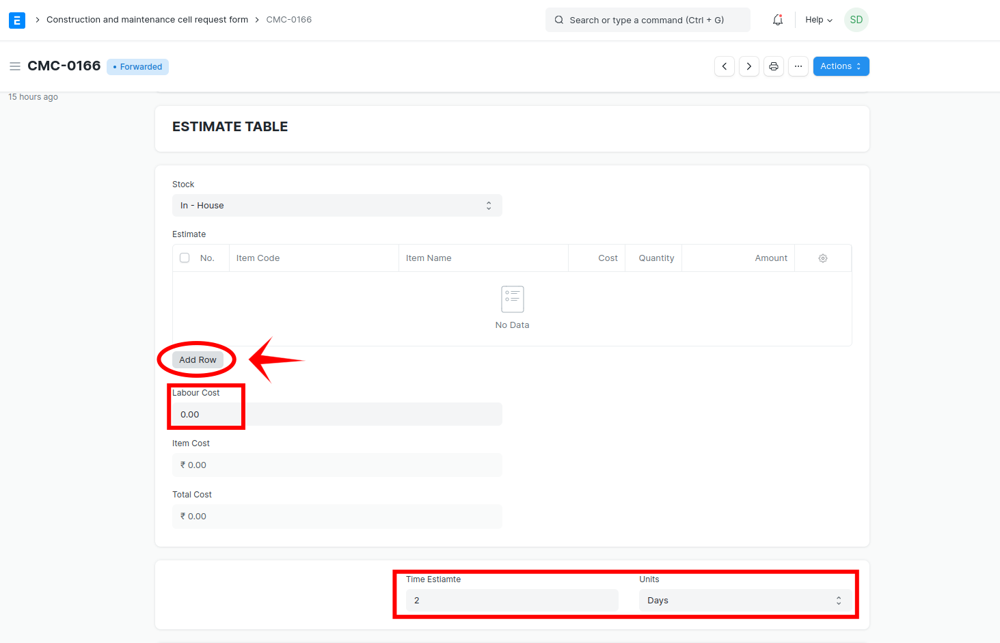

10. Add the item by reading its name, then add quantity, labour cost and the save the request.

  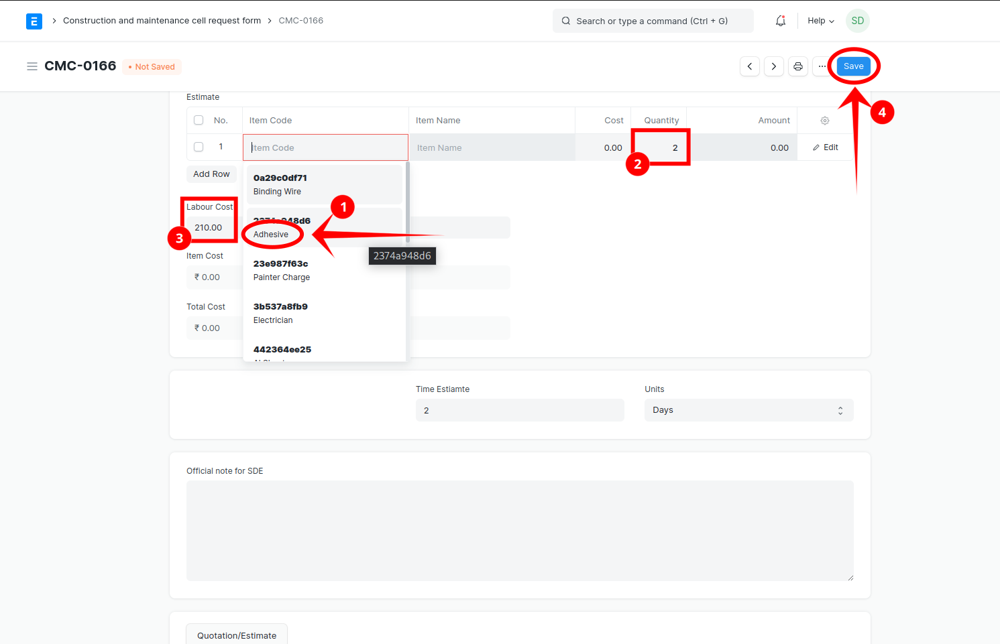

11. Now you will see the action button. Check the form and then `Forward` the request based on the details.

  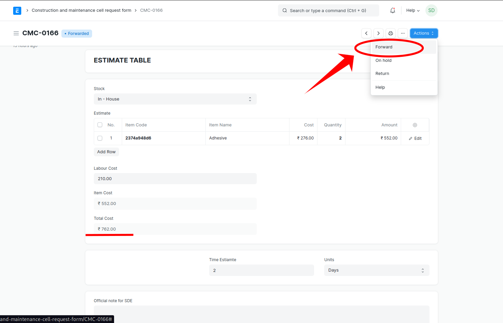

12. The status or request will change, then click on the Logo to go back to desk.

  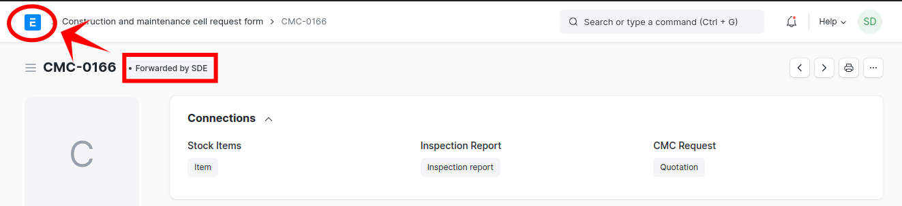

12. Now click on the`Logo` on left hand side to go `CMC Correspondance` again.

[Previous](Hod.md) | [Index](README.md) | [Next](Cmc_Official.md)

